# ✨ Vasitum Dasboard

A responsive dashboard for Vasitum to keep track of job postings, openings, upcoming events and announcements. The React application is responsive and features a customizable theme switcher for an enhanced user experience.

## 🛠️ Technologies Used

- React
- Tailwind CSS
- HTML5
- Vite
- NodeJS

## 📌 Getting Started

To clone the repository and run the application locally, follow these steps:

1. Clone the repository:
   ```sh
   git clone https://github.com/harshpreet14/vasitum.git

2. Navigate to the project directory:
   ```sh
   cd vasitum
   
3. Install the dependencies:
   ```sh
   npm install


4. Start the development server:
   ```sh
   npm run dev

```plaintext
📦root
 ┣ 📂public
 ┃ ┗ 📂assets
 ┃   ┗ ... (assets files)
 ┣ 📂src
 ┃ ┣ 📂components
 ┃ ┃ ┗ ... (component files)
 ┃ ┣ 📜App.css
 ┃ ┣ 📜App.jsx
 ┃ ┣ 📜index.css
 ┃ ┗ 📜main.jsx
 ┣ 📜.eslintrc.js
 ┣ 📜.gitignore
 ┣ 📜index.html
 ┣ 📜package-lock.json
 ┣ 📜package.json
 ┣ 📜postcss.config.js
 ┣ 📜README.md
 ┣ 📜tailwind.config.js
 ┗ 📜vite.config.js
```
## 💻 Desktop Mode
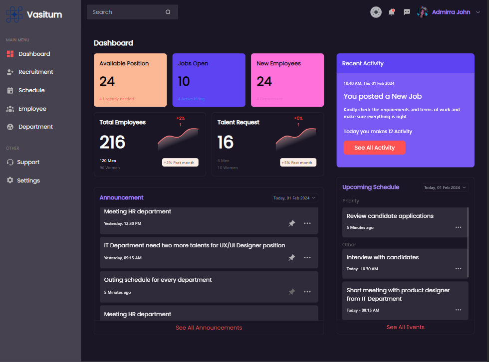
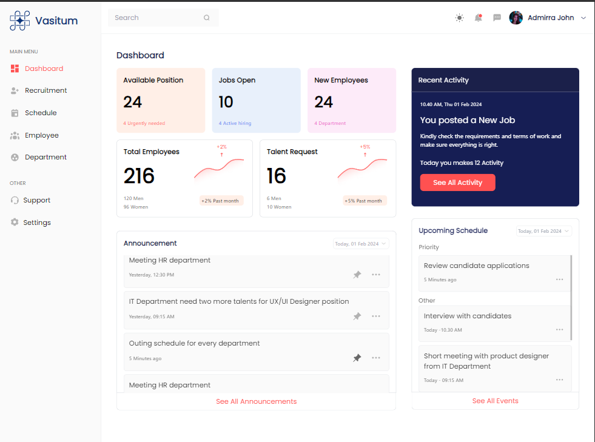

## 🤳🏾 Mobile Mode
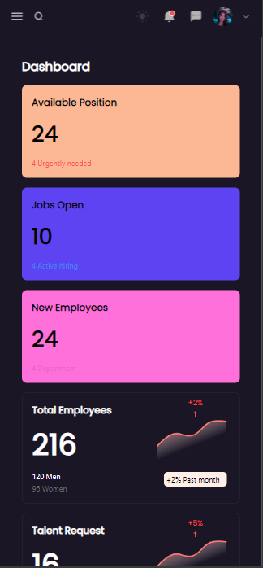
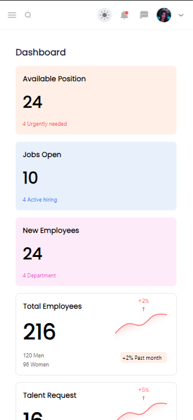
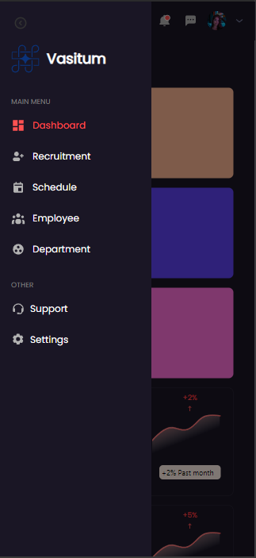
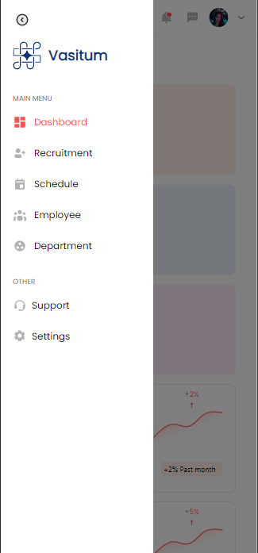
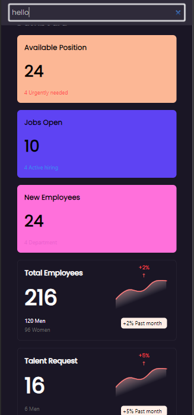
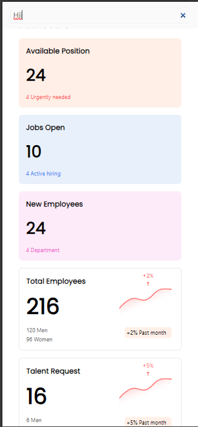

## 📱Tab Mode
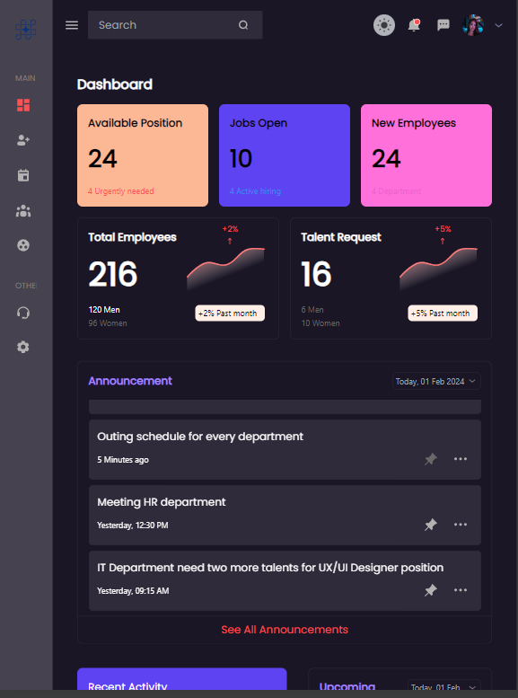
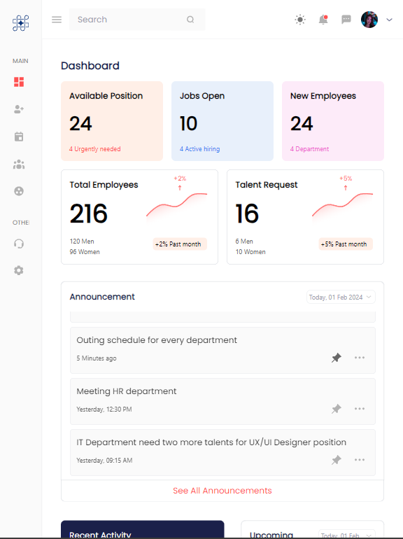
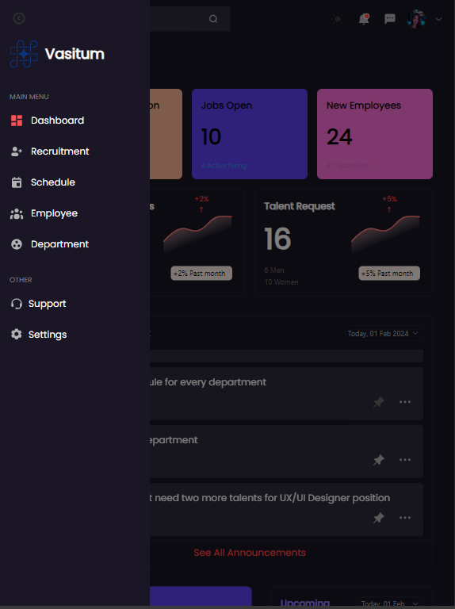
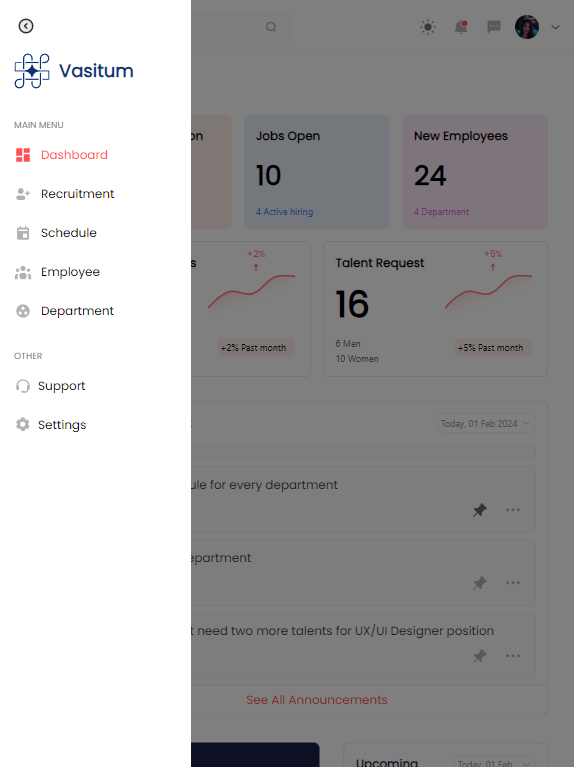

